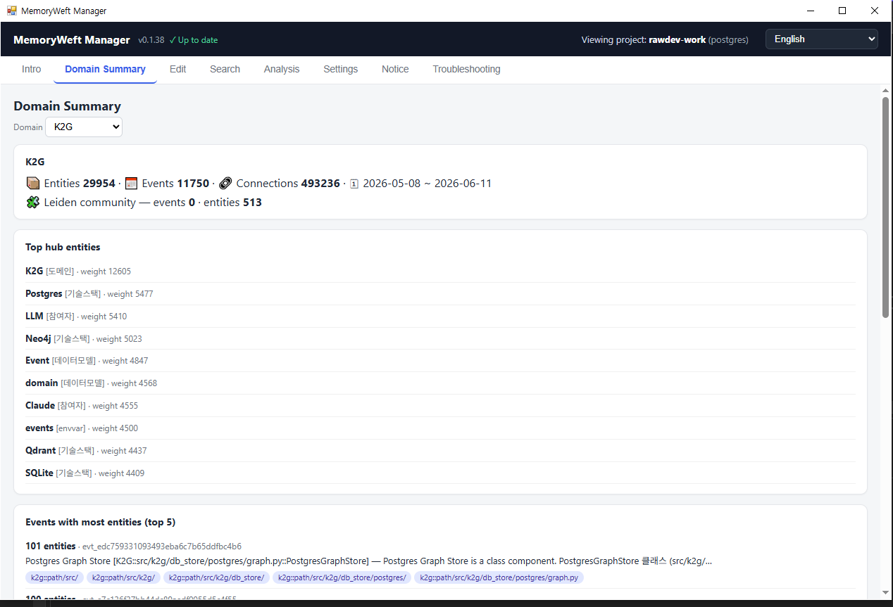
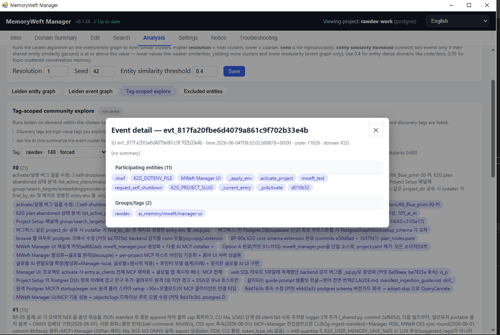
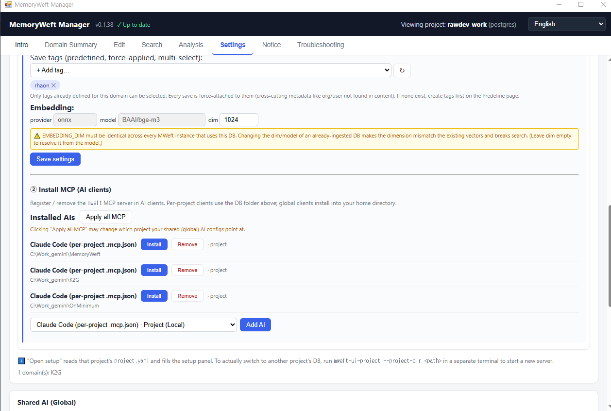
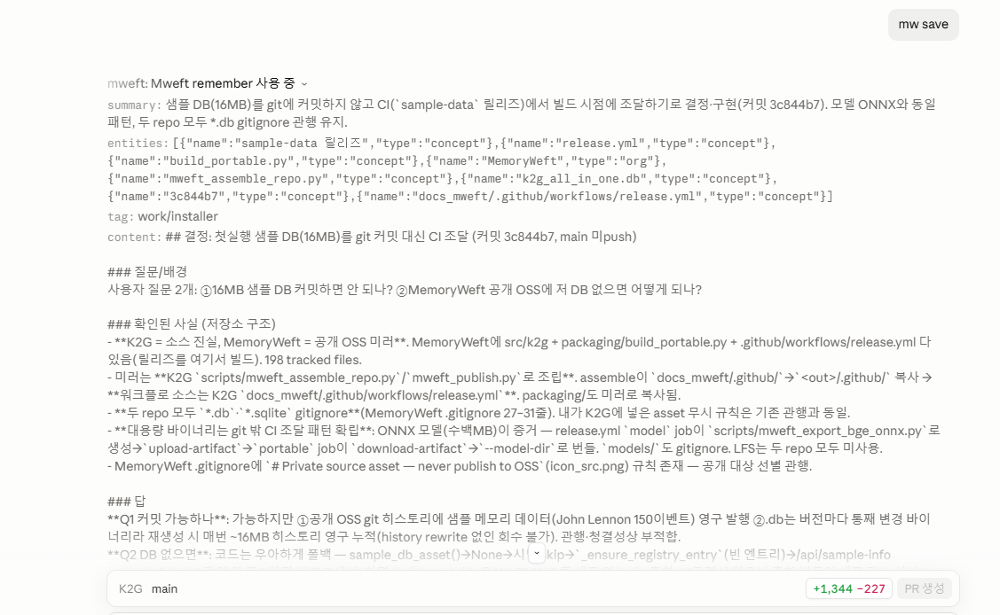

# MWeft

[English](README.md) | **한국어**

MemoryWeft는 **Event-Centric Knowledge Graph(ECKG)** 아이디어를 구현한 지식 그래프 메모리입니다.

단일 SQLite 혹은 Postgres + pgvector 기반 하에 동작하며 stdio MCP 서버기능을 제공합니다.


MemoryWeft는 정보를 엔티티(객체)와 이벤트(객체 관계의 서술)로 나누어 각각 따로 저장하며 텍스트와 RAG 정보 그리고 그래프 관계를 뽑을 수 있는 값을 계산하여 같이 저장합니다.

그렇게 만들어진 그래프 관계는 아래 2개 처럼 정의해서 처리합니다.

1. 엔티티와 엔티티의 관계는 같이 참여하는 이벤트 묶음에 기반하여 정의됩니다. 

2. 이벤트와 이벤트의 관계는 공통 엔티티에 따라 유동적으로 정의됩니다.


MemoryWeft가 제공하는 저장의 수단은 MCP 함수, 문서 대량 적재 2가지 방법을 지원하고 모두 AI에서 호출로 컨트롤 할 수 있습니다. 그리고 저장된 데이터는 단어, RAG, 그래프 관계등 다양한 관점에서 검색할 수 있으며 풍부한 결과를 보여줍니다. 




*번들로 제공되는 **Manager** 앱 — 도메인을 한눈에: 엔티티 / 이벤트 / 커넥션 수,
라이덴 커뮤니티, 상위 허브 엔티티.*

## 30초 아키텍처

노드 종류 
- `엔티티(entities)`
- `이벤트(events)`
- `태그(tags)`

노드 관계
- `participated_in` (엔티티 ↔ 이벤트)
- `event_sequential_next` (이벤트 → 이벤트 — 문서 순서 / 스레드)
- `event_member_of` (이벤트 → 태그)
- `entity_connection` (엔티티 ↔ 엔티티 — 동시출현 횟수)
- `event_jaccard_connected` (이벤트 ↔ 이벤트 — 공유 엔티티/태그 풋프린트)

엔티티와 이벤트 모두 벡터 임베딩(기본 BGE-M3, 프로세스 내 임베딩)을 갖습니다. 


검색은 찾는 내용 뿐만 아니라, **연결 맵 힌트(connection-map hint)** 를 반환합니다 

연결 맵 힌트는 인접 이벤트, 공유 엔티티, 동시출현 이웃, 의미적으로 유사한 이벤트를 반환해서 AI의 추가 행동을 유도합니다.


MemoryWeft는 엔티티 그래프와 이벤트 그래프 양쪽에 라이덴 커뮤니티 탐지(Leiden community detection)를 돌려 자동으로 클러스터를 만들어 냅니다. 

`mweft_auto_tag_*` 와 `mweft_community_*` 도구로 LLM이 클러스터 구조를 요약하고 특정 커뮤니티의 멤버로 파고들 수 있습니다.




*Manager의 **Analysis** 탭은 라이덴 엔티티 / 이벤트 그래프를 그립니다. 노드를
클릭하면 해당 이벤트 상세가 열립니다.*

## 다른 시스템과의 차이

대부분의 그래프 메모리 시스템은 **타입이 지정된 엔티티-엔티티 관계**(`A ─[KNOWS]─ B`, `A ─[WORKS_AT]─ C`)를 추출합니다. 
이 추출은 쓰기 시점에 모델의 해석을 확정합니다.

**MemoryWeft는 미리 정하지 않습니다 : 이벤트 자체가 관계입니다.** 두 엔티티는 같은 이벤트에 함께 참여하면 "관련"되며, 관계의 내용은 그 이벤트의 벡터 + 요약에 담깁니다. 

타입 관계 추출 단계도, 유지할 관계 스키마도 없습니다.

| | MemoryWeft | 다른시스템 |
|---|---|---|
| 관계 모델 | event = edge (벡터 + 요약) | 타입 추출 엣지 |
| 뉘앙스 보존 | 완전 (연속 임베딩) | 손실 (이산 라벨) |
| 스키마 / 드리프트 | 없음 | 온톨로지 필요 |
| 멀티홉 추론 | 의미 기반 (soft-typed) | 정밀 (hard-typed) |
| "아직 유효한가?" | 질의 시점 합성 | 엣지 무효화 |
| 적합 영역 | 서사·설계·진화하는 의미 | 사실형 KB, 시간에 따라 변하는 사실 |

MemoryWeft 모델은 질의 시점에 타입 검색을 *근사*할 수 있습니다. 그래서 MemoryWeft는 관계가 이산적이기보다 결(texture)을 지닐 때
적합합니다: 글쓰기, 설계 맥락, 근거가 담긴 프로젝트 이력 등 "무엇"만큼
"왜"가 중요한 모든 것.


## 이 배포본에 포함된 것

MCP 표면은 엄선된 읽기/저장 도구를 노출합니다:

| | |
|---|---|
| **검색 / 읽기** | `mweft_search`, `mweft_entity_lookup`, `mweft_get_event_content` |
| **그래프 탐색** | `mweft_neighbors`, `mweft_relations`, `mweft_temporal_flow` |
| **커뮤니티** | `mweft_auto_tag_summarize`, `mweft_auto_tag_list`, `mweft_auto_tag_members`, `mweft_auto_tag_detail`, `mweft_auto_tag_of`, `mweft_community_explore`, `mweft_community_residual` |
| **쓰기** | `mweft_remember`, `mweft_remember_edit` |
| **문서 CLI 도구** | `k2g-ingest-manifest`, `k2g-manifest-check` |
| **자유 SQL** | `mweft_sql_query`, `mweft_describe_schema`, `mweft_explain_query` |

검색에 함께 반환되는 힌트:

- `connections.sequential` — 인접 문서 청크
- `connections.similar` — 엔티티 임베딩 이웃
- `connections.connected` — 동시출현 이웃
- `hint.threads` / `entities` / `context_groups` / `categories` — 고정된
  `reason` 태그가 붙은 히트 간 연결 맵

## 상태

**프리릴리스(Pre-release).** 핵심 기능은 안정적입니다.

Postgres DSN을 MCP 설정에서 숨겨주는 기능 등 보조 기능이 아직 없습니다.


## 빠른 시작 — 포터블 앱 (Python 불필요)

가장 쉬운 방법 — Python·pip·설정 파일 없이:

1. **[Releases](https://github.com/rawdev/MemoryWeft/releases/latest)** 페이지에서 OS에 맞는 `mweft-<플랫폼>-<버전>.zip`을 받습니다:
    - **Windows** — `mweft-win-x64-<버전>.zip`
    - **macOS (Apple Silicon)** — `mweft-mac-arm64-<버전>.zip`
    - **macOS (Intel)** — `mweft-mac-x64-<버전>.zip` (현재 지원되지 않습니다.)

2. 압축을 풉니다 — 시스템에 설치하지 않는 "압축 풀고 실행" 방식입니다.
    - **macOS: `다운로드`·`데스크탑`·`문서`(Documents) 폴더에 풀지 마세요.**    
    - 이 폴더들은 macOS 개인정보 보호(TCC)로 보호돼서, AI 클라이언트(Claude 등)가 그 안의 번들로 메모리 서버를 띄우지 못합니다. **홈 폴더**(예: `~/mweft`)에 두세요. 또는 시스템설정 → 개인정보 보호 및 보안 → 전체 디스크 접근 권한에 AI 클라이언트를 추가해도 됩니다. 메모리/데이터 폴더도 이 보호 폴더들 밖에 두세요.

3. 런처를 실행합니다:
    - **Windows** — **`start-mweft.bat`** 더블클릭
    - **macOS** — **`start-mweft.command`** 실행 (처음엔 우클릭 → 열기로 Gatekeeper 해제)

4. **Manager** 창이 열립니다. 
    - 프로젝트를 만들고, 메모리를 둘 곳(로컬 SQLite 폴더 또는 Postgres DSN)을 합니다.
    - **도메인 이름**을 입력 합니다. 도메인 이름은 DB내의 격리 기준 이름입니다. 
    - 프로젝트는 언제든 지우고 다시 만들 수 있습니다. 
    - 시작 후 설정에서 쓰시는 AI 클라이언트(Claude Desktop, Cursor, Claude Code …)에 **MCP 설치**를 누릅니다.

    

    *설정 → **MCP 설치**: mweft 서버를 AI 클라이언트에 등록(프로젝트 단위 또는 전역).*
   
5. **그 AI 클라이언트를 재시작**하세요. 끝입니다 — `mw 검색 …` / `mw 저장 …`을 부르면 됩니다.



*설치 후엔 AI에게 그냥 말하면 됩니다 — `mw 저장 …`으로 저장, `mw 검색 …`으로 회상.*


## 제거 (삭제)

아래 **순서대로** 제거하세요:

1. **AI 에서 설치 제거** — 매니저 **설정** 탭에서 연결한 각 AI 클라이언트의 **제거(Remove)** 를 누르고, 전역 AI(Claude Desktop 등)는 **재시작**하세요. 이걸 먼저 해야 AI 설정에 남은 `mweft` 등록이 깨끗이 지워집니다.
2. **mweft 폴더 제거** — 포터블 압축을 푼 폴더를 통째로 삭제합니다(런타임·모델·`data/` 메모리 포함). `data/` 에 SQLite 메모리 DB 가 들어 있으니 필요하면 먼저 백업하세요.
3. **홈 폴더의 `.mweft` 제거** — `%USERPROFILE%\.mweft`(Windows) / `~/.mweft`(macOS). 프로젝트 목록(`mweft_manager.json`) 등 전역 설정이 들어 있습니다.

포터블 배포본에는 **`uninstall-mweft`** 스크립트(`.bat` / `.command`)가 들어 있어 2·3 단계를 자동 처리합니다 — 1 단계(AI 제거)는 안전을 위해 매니저에서 직접 하세요. **Postgres** 를 썼다면 메모리 DB 는 그 서버에 남으니 따로 삭제하세요.

## 개별 설치 (pip, 개발자용)

```bash
pip install -e .[embed-onnx]
```

BGE-M3 모델을 ONNX로 한 번 export 하고
(`optimum-cli export onnx -m BAAI/bge-m3 ./models/bge-m3-onnx`)
`EMBEDDING_ONNX_PATH`로 가리키세요. 

키 한 줄로 끝나는 API 방식이나 PyTorch 관리 가중치가 더 편하다면 [install.md](docs/install.md#embedding--onnx-openai-or-pytorch)의 임베딩 옵션을 참고하세요.

그다음 MCP 클라이언트에 서버를 등록합니다.

모든 설정은 클라이언트의 `env` 블록에 들어가며 별도 설정 파일이 없습니다. Claude Code 예시
(`~/.claude.json` 또는 프로젝트 단위 `.mcp.json`):

```json
{
  "mcpServers": {
    "mweft": {
      "command": "k2g-mcp",
      "env": {
        "DATA_DIR": "/absolute/path/to/mweft_data",
        "EMBEDDING_PROVIDER": "onnx",
        "EMBEDDING_ONNX_PATH": "/absolute/path/to/models/bge-m3-onnx",
        "EMBEDDING_DIM": "1024"
      }
    }
  }
}
```

전체 설정 — 클라이언트별(Claude Code / Desktop, Cursor, Gemini CLI),
SQLite vs PostgreSQL 백엔드, 모든 env 항목 — 은 [install.md](docs/install.md)를
참고하세요.

네이티브 데스크탑 앱(`mweft-app`)은 도메인·태그·엔티티·검색을 둘러볼 수 있는 창을 제공합니다. `manager` extra
(`pip install -e .[manager]`)를 설치하고 [install.md](docs/install.md#manager-desktop-app-mweft-app)를 참고하세요.

LLM이 MemoryWeft를 잘 쓰도록 만드는 방법(검색 휴리스틱, 저장 트리거, 연결 맵, 힌트)은 [prompt_guide.md](docs/prompt_guide.md)를 참고하세요 — 스니펫을 `CLAUDE.md` / `GEMINI.md` / `.cursorrules`에 넣으면 됩니다.

## 첫 실행 & 백신

맨 처음 실행 또는 재부팅 직후 첫 연결은 느릴 수 있습니다. 백신/보안 소프트웨어(Windows Defender 등)가 임베딩 모델, 런타임 라이브러리, DB 파일을 **첫 접근 시** 검사하기 때문이며, 한 번 검사되면 시작이 빨라집니다. 매번 콜드 부팅이 느리다면 **설치 폴더와 `DATA_DIR`을 백신 실시간 검사 예외에 추가**하면 콜드 스타트가 크게 빨라집니다. 
macOS에서는 Gatekeeper / 격리 검사가 비슷한 일회성 첫 실행 지연을 유발할 수 있습니다. 이는 멈춤이 아니라 검사 비용입니다. 서버는 정상적으로 뜨며, 첫 접근만 느립니다.

## 라이선스

[Apache License 2.0](LICENSE).

